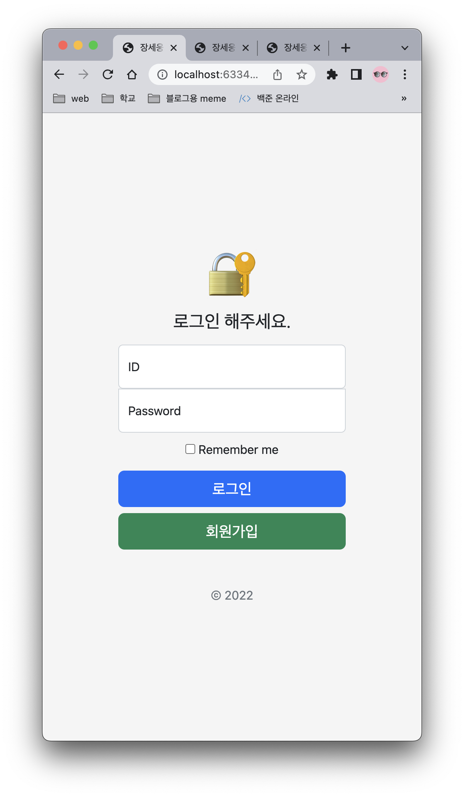
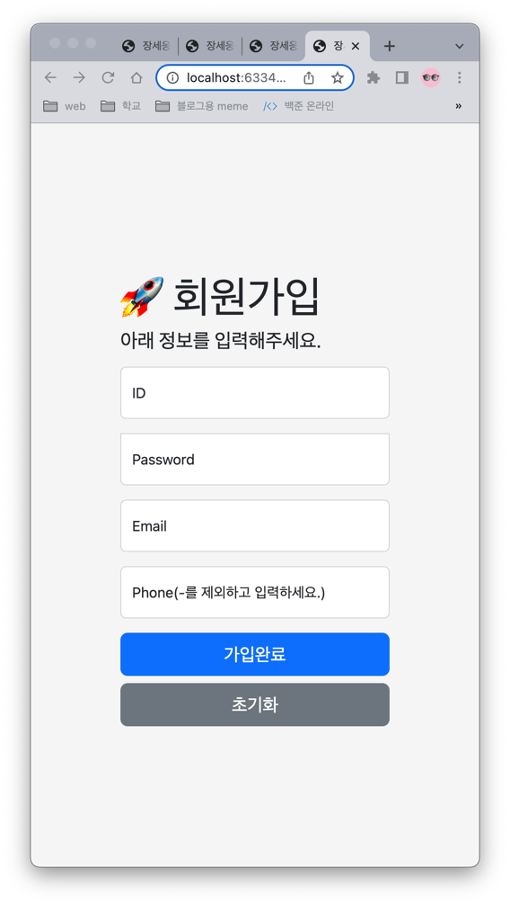
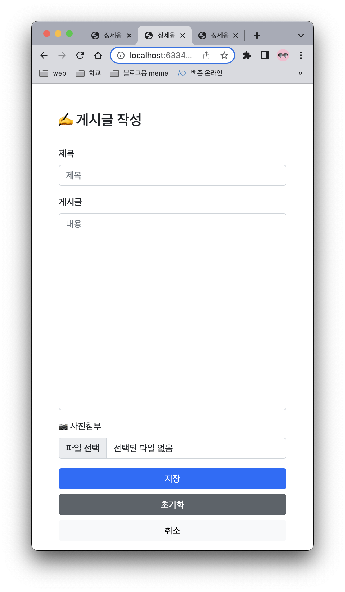

# 📋 게시판 만들기
목표: 게시판을 만들 수 있다.

## 기술스택

 

## 기능
1. 회원가입, 로그인, 로그아웃
2. 게시글 작성, 수정, 삭제
   * 사진 첨부 가능(최대 5장)
3. 게시글 조회
   * 제목으로 조회
   * 내용으로 조회

## 화면
### 로그인

### 회원가입

### 게시글

### 게시글 목록

## DB(ERD)

